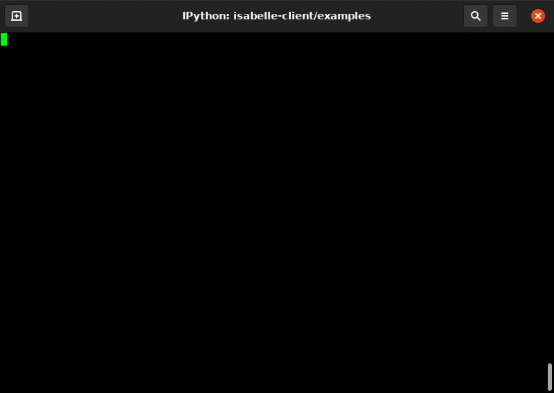

..
  Copyright 2021 Boris Shminke

  Licensed under the Apache License, Version 2.0 (the "License");
  you may not use this file except in compliance with the License.
  You may obtain a copy of the License at

      https://www.apache.org/licenses/LICENSE-2.0

  Unless required by applicable law or agreed to in writing, software
  distributed under the License is distributed on an "AS IS" BASIS,
  WITHOUT WARRANTIES OR CONDITIONS OF ANY KIND, either express or implied.
  See the License for the specific language governing permissions and
  limitations under the License.

  
=================================
Python client for Isabelle server
=================================

``isabelle-client`` is a TCP client for
`Isabelle <https://isabelle.in.tum.de>`__ server. For more information
about the server see part 4 of `the Isabelle system
manual <https://isabelle.in.tum.de/dist/Isabelle2021/doc/system.pdf>`__.

How to Install
==============

The best way to install this package is to use ``pip``:

.. code:: sh

   pip install isabelle-client

How to use
==========

Follow the :ref:`usage-example` from documentation or run the
`script <https://github.com/inpefess/isabelle-client/blob/master/examples/example.py>`__.

How to Contribute
=================

`Pull requests <https://github.com/inpefess/isabelle-client/pulls>`__
are welcome. To start:

.. code:: sh

   git clone https://github.com/inpefess/isabelle-client
   cd isabelle-client
   # activate python virtual environment with Python 3.6+
   pip install -U pip
   pip install -U setuptools wheel poetry
   poetry install
   # recommended but not necessary
   pre-commit install

To check the code quality before creating a pull request, one might run
the script
`show_report.sh <https://github.com/inpefess/isabelle-client/blob/master/show_report.sh>`__.
It locally does nearly the same as the CI pipeline after the PR is
created.

Reporting issues or problems with the software
==============================================

Questions and bug reports are welcome on `the
tracker <https://github.com/inpefess/isabelle-client/issues>`__.

More documentation
==================

More documentation can be found
`here <https://isabelle-client.readthedocs.io/en/latest>`__.

Video example
=============

|video tutorial|.

How to cite
===========

If you’re writing a research paper, you can cite Isabelle client (and
Isabelle 2021) using the `following
DOI <https://doi.org/10.1007/978-3-030-81097-9_20>`__.
			    
.. toctree::
   :maxdepth: 3
   :caption: Contents:

   usage-example
   package-documentation

Indices and tables
*******************

* :ref:`genindex`
* :ref:`modindex`
* :ref:`search`

